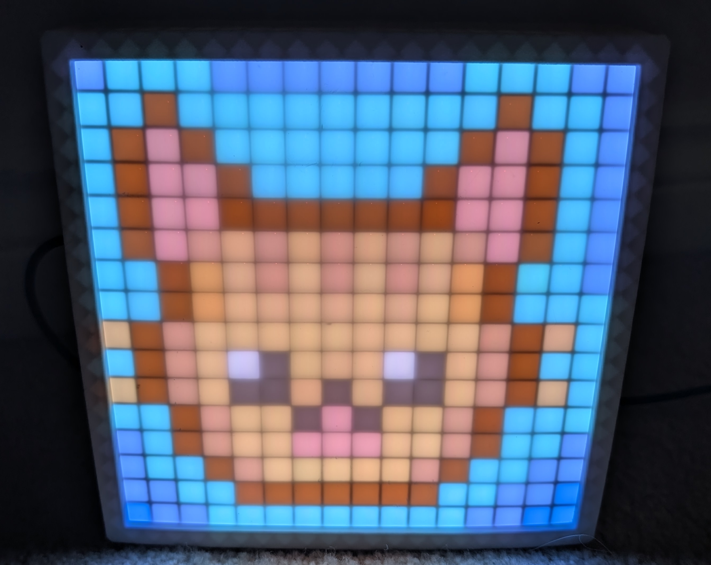
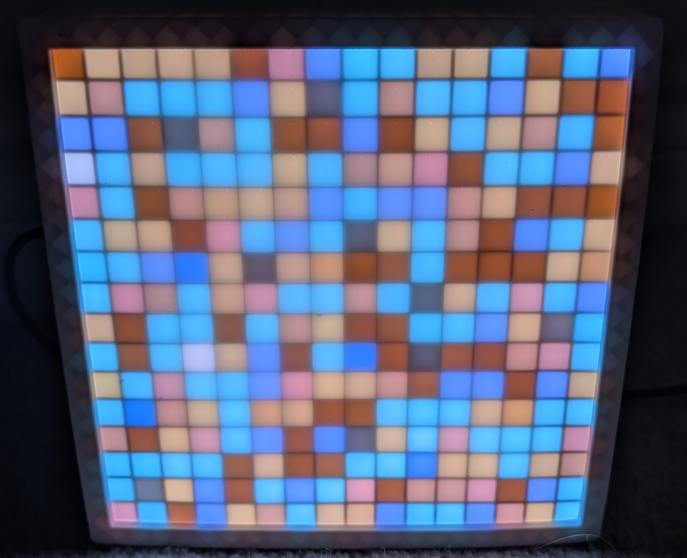

<h1> Five Reasons to Create 'bad' mathart </h1>

<strong>Abstract:</strong> 

 Mathematics is enriched when coupled with acts of making that enable ideas to be looked at from multiple angles. In this talk, I will advocate for the significance of making as a mode of mathematical inquiry, not necessarily to produce polished handicraft but because the attempt itself deepens understanding and fosters new insights. I will illustrate this point through an example from my own practice: implementing the Arnold Cat Map, a classic area preserving automorphism of the torus, on an ESP32 micro-controller to encrypt an image on a 16-by-16 addressable led screen. The process of using hyperbolic measure preserving transformations for image encryption piqued my interest and opened the door for lots of interesting questions. Through this example, I will argue that making, regardless of its final form, can be a worthwhile mathematical endeavor. It allows ideas to be encountered in new ways, encourages a willingness to experiment and to fail, and ultimately deepens mathematical thinking and discovery.

  
  

View the presentation slides at <a>https://polygonart6777.github.io/badmathart/ </a>

Note: Using the 'S' key will show the speaker notes.  Using the 'G' key will allow you to go to a particular slide.

This presentation was built with reveal.js, an open source HTML presentation framework. It enables anyone with a web browser to create beautiful presentations for free. Check out the live demo at [revealjs.com](https://revealjs.com/).

